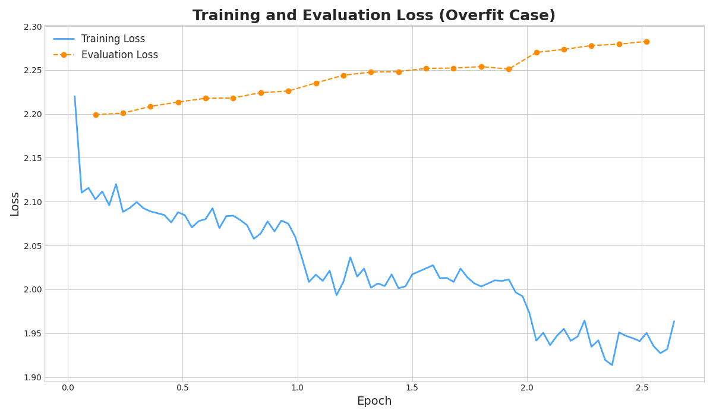
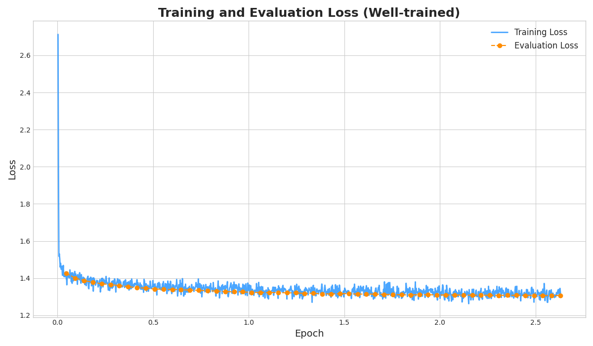

# A Qwen-based Summarization Project

## 1. Adapter Architecture
### Overview

This implementation employs **LoRA (Low-Rank Adaptation)** as the parameter-efficient fine-tuning strategy for the Qwen 2.5 3B base model. LoRA enables targeted adaptation of large language models by introducing trainable low-rank decomposition matrices while keeping the original model parameters frozen.

The architecture is composed of two primary components:

1.  **The Frozen Base Model**: The Qwen 2.5 3B model acts as the foundation, providing general language understanding. Its weights are not updated during training.
2.  **The LoRA Adapter Matrices**: These are the only trainable components.
    * **Low-Rank Matrices ($A$ and $B$)**: For each target layer, we decompose the weight update into two much smaller matrices. The size of these matrices is controlled by the hyperparameter **rank ($r$)**, which we set to **16**. This means if the original weight update would have been a $d \times k$ matrix, we approximate it with two matrices of size $d \times r$ and $r \times k$.

### Adaptor  Specifications

The adapter integrates with the base model through the PEFT (Parameter-Efficient Fine-Tuning) library, specifically targeting the attention and feed-forward network components:

- **Base Model**: Qwen 2.5 3B (3,104,665,600 parameters)
- **Trainable Adapter Parameters**: 18,726,912 parameters (0.60% of total)
- **Task Type**: Causal Language Modeling
- **Precision**: FP16 for memory efficiency

### LoRA Configuration

```yaml
lora:
  r: 16                    # Rank of adaptation
  alpha: 32               # Scaling parameter to stabilize training
  dropout: 0.4            # Regularization
  target_modules:
    - "q_proj"            # Query projection layer
    - "v_proj"            # Value projection layer  
    - "up_proj"           # Feed-forward up projection
    - "down_proj"         # Feed-forward down projection
```

### Architectural Advantages

1. **Parameter Efficiency**: Only 0.6% of model parameters require training, dramatically reducing computational costs and memory requirements.

2. **Preservation of Base Knowledge**: The frozen base model retains its pre-trained language understanding capabilities while the adapter learns the summarization patterns.

3. **Modular Design**: The LoRA adapter can be easily merged, unloaded, or combined with other adapters, providing deployment flexibility.

4. **Reduced Overfitting Risk**: LoRA can act as implicit regularization, particularly valuable when training on smaller datasets.

5. **Fast Training and Inference**: Minimal parameter updates enable rapid fine-tuning cycles and efficient inference.

## 2. Input and Output Formats

### Input Format

The summarization adapter accepts news articles in plain text format and transforms them into a standardized format to guide the model's summarization behavior.

**Template Structure:**
```
[INST] Summarize the following news article:

{Article}

Summary: [/INST]
```

**Key Components:**
- **`[INST]` and `[/INST]`**: Tokens delineate the user instruction from the expected model response
- **"Summarize the following news article"**: Clear specification of the summarization task
- **{Article}**: The actual text content for summarization
- **"Summary:"**: signals where the model should begin generating

**Input Processing:**
- **Maximum Length**: 2048 tokens total (instruction + article + summary)
- **Smart Truncation**: When articles exceed token limits, the system preserves the template structure while truncating article content from the end

**Example Raw Input:**
```json
{
  "Shoplifting was once again the top physical crime in Singapore, with 2,097 cases reported in the first half of 2025, the police said on Tuesday (Aug 26). This was a 4.2 per cent increase - or 84 cases - compared to the 2,013 cases last year from January to June. The overall number of physical crime cases similarly increased by 5.4 per cent to 10,341 in the first half of 2025, up from 9,809, according to mid-year statistics released by the Singapore Police Force (SPF). Shop theft accounted for 20.3 per cent of total crime, forming the largest proportion of cases. It also remains one of the top offences committed by youths."
}
```

**Processed Input:**
```
[INST] Summarize the following news article:

SINGAPORE: Shoplifting was once again the top physical crime in Singapore, with 2,097 cases reported in the first half of 2025, the police said on Tuesday (Aug 26). This was a 4.2 per cent increase - or 84 cases - compared to the 2,013 cases last year from January to June. The overall number of physical crime cases similarly increased by 5.4 per cent to 10,341 in the first half of 2025, up from 9,809, according to mid-year statistics released by the Singapore Police Force (SPF). Shop theft accounted for 20.3 per cent of total crime, forming the largest proportion of cases. It also remains one of the top offences committed by youths.

Summary: [/INST]
```

### Output Format

The adapter generates the summary in plain text format with the following configuration

**Generation Parameters:**
```yaml
generation:
  max_new_tokens: 100        # Maximum summary length
  temperature: 0.7           # Controlled randomness
  do_sample: true           # Enable sampling for variety
```

**Example Output:**
```json
{
 "Shoplifting was the top physical crime in Singapore .It was a 4.2 per cent increase - or 84 cases - compared to last year . Overall number of physical crime cases increased by 5.4 per cent ."
}
```

**Post-Processing:**
The system extracts only the generated content following the `[/INST]` marker, ensuring clean output free from template artifacts. 

## 3. Evaluation Metrics

### 3.1 ROUGE-L 
ROUGE-L measures the longest common subsequence (LCS) between generated summaries and reference summaries, providing insight into structural and content overlap.

**Why ROUGE-L**: 
- Unlike ROUGE-1/2 which focus on n-gram overlap, ROUGE-L considers sentence-level structure and word order
- ROUGE-L can captures in-sequence matches even when words are not adjacent
- Widely adopted in summarization literature

**Interpretation**:
- **Range**: 0.0 to 1.0 (higher is better)
- **Typical Performance**: Good summarizers achieve 0.35-0.45 on CNN/DailyMail
- **Threshold**: Improvements of ≥0.02 are meaningful

**ROUGE-L Limitations**:
- **Lexical Bias**: May undervalue semantically correct but lexically different summaries
- **Reference Dependency**: Quality limited by reference summary quality
- **Surface-Level Focus**: Cannot capture deep semantic understanding

### 3.2 BERTScore F1

BERTScore uses contextual embeddings from BERT to measure semantic similarity between generated and reference summaries, addressing limitations of lexical overlap metrics.

**Why BERTScore**:
- Captures meaning beyond surface-level word matching
- Less sensitive to paraphrasing and synonym usage
- Considers word meanings in context rather than isolated tokens

**Interpretation**:
- **Range**: Typically 0.85-0.95 for summarization tasks
- **Baseline**: Scores below 0.87 indicate poor semantic alignment
- **Improvement Significance**: Gains of ≥0.005 represent substantial semantic improvements

**BERTScore Limitations**:
- **Computational Cost**: More expensive than lexical metrics
- **Model Bias**: Inherits biases from underlying BERT model
- **Language Specificity**: Optimized for English; performance may vary for other languages

## 4. Dataset

For training and evaluating our LoRA-based summarization adapter, we utilize the **CNN/DailyMail dataset version 3.0.0**, a widely-adopted benchmark in text summarization research. This dataset provides high-quality news articles paired with multi-sentence summaries, making it ideal for training  summarization models.

### Dataset Characteristics

#### 4.1 Dataset Composition

**Source and Domain**:
- **CNN Articles**: Technology, politics, health, and general news 
- **Daily Mail Articles**: Broader coverage including entertainment, sports, and lifestyle
- **Language**: English, professionally written and edited

**Content Structure**:
- **Articles**: Full-length news articles with journalistic writing style
- **Highlights**: Human-written bullet-point summaries (typically 3-4 sentences)
- **Length Distribution**: Articles range from 200-2000 words, summaries 50-150 words

#### 4.2 Dataset Statistics

```yaml
dataset:
  name: "cnn_dailymail"
  version: "3.0.0"
  total_examples: 311,971
  splits:
    train: 287,113 examples
    validation: 13,368 examples  
    test: 11,490 examples
```
## 5. Implementation Plan

### Overview

This section outlines the implementation workflow for developing the LoRA-based summarization adapter, incorporating the actual execution experience that I encountered and my solution.

### 5.1 Development Environment Setup

**Hardware Configuration**:
- **GPU**: NVIDIA GPU A100 with 40GB memory
- **OS**: Ubuntu 22.04
- **Pytorch**: 2.3.1
- **CUDA**: 11.8

**Software Environment**:
```bash
transformers==4.55.4
datasets==4.0.0
peft==0.17.1
accelerate==1.10.0
bitsandbytes==0.47.0
pyyaml==6.0.2         
rouge-score==0.1.2    
bert-score==0.3.13     
nltk==3.9.1    
```

### 5.2 Data Preprocessing Pipeline

#### 5.2.1: Dataset Loading and Initial Processing

**Objective**: To load the raw dataset and consistently apply the instruction template to each article-summary pair.

**Challenge**: Ensure the text data is transformed to the designed template, remember to handle some edge cases to prevent nan gradient problem 

**Solution**: Debug by print out the first few processed examples was crucial to ensure the template was applied correctly and that no special characters or formatting issues were introduced.

#### 5.2.2: Smart Tokenization and Truncation

**Objective**: To tokenize the input data while ensuring that long articles do not exceed the model's max_length of 2048 tokens

**Challenge**: Initial attempts using the standard tokenizer's left-side truncation (`truncation_side="left"`) was problematic. This approach would  truncate parts of the instruction template (e.g., [INST]) or the crucial Summary: [/INST] markers. This corrupted the designed input data, leading to an unstable loss and preventing the model from learning the summarization task effectively

**Solution**: Add our own truncation to the tokenization step. This idea is to target only the article portion of the prompt for truncation. It finds the start and end of the article text and removes tokens from the end of the article content until the total length fits within the model's context window. This stabilized the loss during the training. 
```python
def _tokenize_function(examples: Dict[str, List[str]], tokenizer: AutoTokenizer) -> Dict[str, List]:
    """
    Tokenizes the instruction and summary separately, applies prompt masking.
    """
    input_ids_list = []
    labels_list = []

    for idx, (inst, summ) in enumerate(zip(examples['instruction'], examples['summary'])):
        inst_tokens = tokenizer(inst, add_special_tokens=False, truncation=False)['input_ids']
        
        summ_text = " " + summ + tokenizer.eos_token
        summ_tokens = tokenizer(summ_text, add_special_tokens=False, truncation=False)['input_ids']
        
        full_tokens = inst_tokens + summ_tokens
        
        if len(full_tokens) > tokenizer.model_max_length:
            excess = len(full_tokens) - tokenizer.model_max_length
            inst_text = inst  

            # Find article start and end markers in your template
            article_start_marker = "Summarize the following news article:\n\n"
            article_end_marker = "\n\nSummary:"
            
            start_idx = inst_text.find(article_start_marker) + len(article_start_marker)
            end_idx = inst_text.find(article_end_marker)
            
            if start_idx != -1 and end_idx != -1:
                # Extract parts
                prefix = inst_text[:start_idx]  # "[INST] Summarize the following news article:\n\n"
                article = inst_text[start_idx:end_idx]  # The actual article content
                suffix = inst_text[end_idx:]  # "\n\nSummary: [/INST]"
                
                # Truncate only the article part
                article_tokens = tokenizer(article, add_special_tokens=False)['input_ids']
                if len(article_tokens) > excess:
                    truncated_article_tokens = article_tokens[:-excess]  # Remove from end of article
                    truncated_article = tokenizer.decode(truncated_article_tokens, skip_special_tokens=True)
                    
                    # Reconstruct with truncated article
                    truncated_inst = prefix + truncated_article + suffix
                    inst_tokens = tokenizer(truncated_inst, add_special_tokens=False)['input_ids']
                    
                else:
                    # If article is shorter than excess, use original 
                    inst_tokens = inst_tokens[:-excess]
            else:
                print(f"Could not find article boundaries, using fallback truncation")
                # Fallback to original logic if parsing fails
                inst_tokens = inst_tokens[:-excess]

            full_tokens = inst_tokens + summ_tokens
        
        inst_len = len(inst_tokens)
        # Masking the instruction part for better training
        labels = [-100] * inst_len + summ_tokens

        input_ids_list.append(full_tokens)
        labels_list.append(labels)

    return {
        "input_ids": input_ids_list,
        "labels": labels_list
    }
```

#### 5.2.3: Input Masking Implementation

**Objective**: To focus the model's learning exclusively on generating the summary, rather than learning to reproduce the input article.

**Challenge**: At the beginning, I trained the model without masking the instruction part. This created a noisy loss signal, as the model spent a significant portion of its capacity trying to predict the input prompt. As a result, the training loss decreased very slowly and erratically

**Solution**: Mask instruction tokens (set labels to -100) for the model to focus learning on summary generation.
```python
inst_len = len(inst_tokens)
labels = [-100] * inst_len + summ_tokens  # Mask instruction, learn summary
```

#### 5.2.4: Custom Data Collator

**Objective**: To batch training data by padding them to the length of the longest sequence in the batch, not the absolute maximum length.

**Challenge**:   The Transformers library automatically detects available GPUs and initializes multiple data loading processes even with `batch_size=1`, unless explicitly controlled via `_n_gpu=1` in TrainingArguments. This created a critical issue where NaN gradients would occasionally appear, causing training crashes.

**Solution**:  A `CustomDataCollator` was created to handle dynamic padding. More importantly, a safety check was added to prevent NaN gradients. If the collator detects a batch where all labels are masked (-100), it will un-mask a single token. This ensures there is always at least one label for the loss function to compute a gradient on, even if it's a trivial one, thus preventing the NaN problem.

```python
# Safety check for trainable tokens
if (batch_labels != -100).sum().item() == 0:
    print(f"CRITICAL: Batch has no trainable tokens! This will cause NaN gradients.")
    batch_labels[0, 0] = padded_input_ids[0][0].item()
    print(f"Emergency fix applied: made 1 token trainable")
    
return {
    'input_ids': batch_input_ids,
    'attention_mask': batch_attention_masks,
    'labels': batch_labels
}
```

### 5.3 Model Architecture Implementation

**Objective**: To efficiently train the LoRA adapter on the CNN/DailyMail dataset.

**Challenge**: A challenge emerged early in the fine-tuning process: the Qwen 2.5 3B model began to severely overfit the training data after only a few hundred steps. This was clearly observed by a consistently decreasing training loss while the validation loss started to increase. Expanding the training set from 40k up to 160k samples did not resolve the issue. 

<p align="center">

<br>
<em>Figure 1: Clear overfitting with decreasing training loss and increasing validation loss.</em>
</p>

**Solution**: The key idea is to force the model to learn from data instead of simply memorizing the training data. The solution was to make the learning task more difficult by applying aggressive regularization techniques:

- **High LoRA Dropout**: The dropout was systematically increased from a standard 0.1 to a much higher 0.5. This proved to be the most impactful change, forcing the model to learn more robust features by preventing co-adaptation of neurons.

- **Weight Decay**: A weight_decay of 0.01 was introduced during optimization to penalize large weight values, acting as an effective L2 regularization technique to promote a simpler, more generalizable model.

- **Lower Learning Rate**: An initial learning rate of 2e-4 is too big and led to instability. Reducing it to 1.0e-5 resulted in a more stable and gradual convergence.  

**LoRA Configuration Applied**:
```python
# LoRA settings
lora:
  r: 16
  alpha: 32
  dropout: 0.5
  target_modules:
    - "q_proj"
    - "v_proj"
    - "up_proj"
    - "down_proj"

```
<p align="center">

<br>
<em>Figure 2: Stable training after applying regularization techniques.</em>
</p>

### 5.4 Training Execution

**Objective**: To execute the training process on 40GB A100 GPUs by optimizing memory usage without compromising the stability of the fine-tuning configuration.

**Challenge**: The primary challenge was fitting the 3B-parameter model and its training components (gradients, optimizer states) within the 40GB VRAM of a single A100 GPU. Initial attempts with standard configurations resulted in out-of-memory errors. 

**Solution**: To overcome the VRAM limitations use:

- **Paged 8-bit Optimizer**: The standard AdamW optimizer was replaced with paged_adamw_8bit. This dramatically reduces the memory footprint of the optimizer states.

- **Gradient Accumulation**: The physical batch_size was reduced to 1. To compensate and ensure stable gradient updates, gradient_accumulation_steps was set to 4, achieving an effective batch size of 4.

- **Mixed-Precision Training**: FP16 was enabled to halve the memory required for model weights, activations, and gradients.

**Monitoring Metrics**:
- **Training Loss**: Tracked every 50 steps
- **Validation Loss**: Evaluated every 1000 steps
- **Learning Rate**: Cosine decay schedule monitoring
- **Gradient Norms**: Monitored for training stability

### 5.6 Evaluation Implementation
**Objective**: To measure the summarization performance of the fine-tuned adapter against the original base model.
**Challenge**: Evaluating the trained model on extensive test sets with metrics like BERTScore is very slow. 

**Solution**: 
- The evaluation script was first run on the base Qwen model to provide an initial benchmark to measure the fine-tuned adapter's improvement. For a fair comparison, make sure the input template is the same for both models.

- The batch evaluation script (evaluate.py) was developed concurrently while the main model was training. This efficient use of time ensured that the evaluation pipeline was debugged and ready for immediate use once the first adapter checkpoint was saved.

- The evaluation was focused on two key metrics: ROUGE-L for lexical overlap and BERTScore F1 for semantic similarity, avoiding the overhead of running a large, redundant suite of metrics. The batched implementation was particularly critical for speeding up BERTScore calculations. 

#### Performance Results

| Model | ROUGE-L | BERTScore F1 | Avg Gen Length |
|-------|---------|--------------|----------------|
| Base Qwen 2.5 3B | 0.2211 | 0.8661 | 77.6 words (ref: 54.2) |
| LoRA Adapter | 0.2972 | 0.8893 | 57.6 words (ref: 54.2) |
| **Improvement** | **+0.0761 (+34.41%)** | **+0.0232 (+2.67%)** | **-20.0 words** |

### 5.7 Post-Processing and Deployment

**Objective**: To establish a robust deployment pipeline that guarantees consistent model behavior between training and inference and reliably extracts the final summary from the model's raw output.

**Challenge**: We must ensure the model receives data in the exact same format during inference as it did during training. Any discrepancies in tokenization, padding, or truncation can lead to significant performance degradation. Furthermore, the model appends the generated text to the original input prompt during inference, requiring a method to extract only the summary.

**Solution**: The inference pipeline reuses the exact same tokenizer configuration and truncation logic developed for the training pipeline. Also, a summary extraction function is used to isolate the generated summary from the full output.

### 5.6 Future Enhancements

#### 5.6.1 Context Window Extension

**Objective**: Expand the model's effective context length from the current 2048-token limitation to handle long-form documents (8k-10k tokens). 

**Challenge**: The 2048-token constraint limits the system's applicability to real-world scenarios. Many technical documents, research papers, news articles exceed this limit, forcing aggressive truncation that loses critical information. The current smart truncation approach will discard potentially important content from article endings.

**Solution**: Implement a multi-stage hierarchical processing pipeline with the following components:

- **Map Phase**: The long document is split into smaller, overlapping chunks that fit within the model's context. The summarization adapter is then run on each chunk individually to create intermediate summaries.

- **Reduce Phase**: The intermediate summaries are concatenated and fed back into the model to generate a final, cohesive summary of the entire document. This process can be repeated recursively if needed.

#### 5.6.2 Multi-Objective Loss Enhancement

**Objective**: Replace the single cross-entropy loss with a multi-objective function that optimizes for more summarization criteria such as content coverage, factual accuracy, length control, and semantic coherence simultaneously.

**Challenge**: The current training relies solely on cross-entropy loss, which is optimized for token-level prediction but doesn't explicitly encourage desired summarization properties like entity coverage, appropriate compression ratios, or factual consistency. 

**Solution**: Depend on our summarization preference, we can nudge the model toward the summarization criteria you want. We can implement the multi-component loss function that is a weighted average of those criteria. 

## 6. Source Code and Installation 

### Repository Access

**Source Code**: The complete implementation is available at: https://github.com/paladin1410/qwen_sum

**Project Structure**:
```
qwen_sum/
├── src/
│   ├── data/processing.py          # Dataset loading and preprocessing
│   ├── training/train.py           # LoRA adapter training pipeline
│   ├── evaluation/evaluate.py     # Model evaluation with metrics
│   └── inference/inference.py     # Single example inference demo
├── models/
│   └── qwen-model/                 # Downloaded Qwen 2.5 3B base model
├── results/
│   └── 260k_adapter/
│       └── checkpoint-57000/       # Trained LoRA adapter checkpoint
├── configs/param.yaml             # Complete project configuration
├── download_models.py             # Script to download base model
└── requirements.txt               # Python dependencies
```

### Installation Instructions

**Recommended Environment**: Docker container with CUDA support

```bash
# Pull recommended Docker image
docker pull pytorch/pytorch:2.3.1-cuda11.8-cudnn8-devel

# Run container with GPU access
docker run --gpus all --name qwen_sum -it pytorch/pytorch:2.3.1-cuda11.8-cudnn8-devel

# Clone repository
apt update && apt install -y git
git clone https://github.com/paladin1410/qwen_sum.git
cd qwen_sum

# Install dependencies
pip install -r requirements.txt
```

### Usage Instructions

**First, download the Qwen 2.5 3B base model, this may take 1 hour**:

```bash
python download_models.py
```

#### Training the LoRA Adapter

```bash
python -m src.training.train
```

**Training Configuration**: Modify `configs/param.yaml` for custom settings:
- Dataset splits and sizes
- LoRA parameters (rank, alpha, dropout)
- Training hyperparameters (learning rate, batch size, epochs)

#### Model Evaluation

```bash
python -m src.evaluation.evaluate
```

**Evaluation Configuration**: Update checkpoint path in `configs/param.yaml`:

```yaml
evaluation:
  # Specify trained checkpoint to evaluate
  adapter_path_to_evaluate: "./results/260k_masking_dr05/checkpoint-57000"
  num_examples: 10000        # Test set size
  batch_size: 128            # Inference batch size
  input_max_length: 1600     # Max input tokens
  generation:
    max_new_tokens: 100      # Summary length limit
    temperature: 0.0         # Deterministic generation
    do_sample: false
```

#### Single Example Inference

```bash
python -m src.inference.inference
```

**Expected Results**:

**Input**:
```
[INST] Summarize the following news article:

SINGAPORE: Shoplifting was once again the top physical crime in Singapore, with 2,097 cases reported in the first half of 2025, the police said on Tuesday (Aug 26). This was a 4.2 per cent increase - or 84 cases - compared to the 2,013 cases last year from January to June. The overall number of physical crime cases similarly increased by 5.4 per cent to 10,341 in the first half of 2025, up from 9,809, according to mid-year statistics released by the Singapore Police Force (SPF). Shop theft accounted for 20.3 per cent of total crime, forming the largest proportion of cases. It also remains one of the top offences committed by youths.

Summary: [/INST]
```

**Generated Output**:
```
Shoplifting was the top physical crime in Singapore in the first half of 2025 . It was followed by robbery and burglary . The overall number of physical crime cases increased by 5.4 per cent .

```

### Trained Model Access

**LoRA Adapter**: The trained checkpoint achieving optimal performance is located at:
```
qwen_sum/results/260k_masking_dr05/checkpoint-57000/
```


